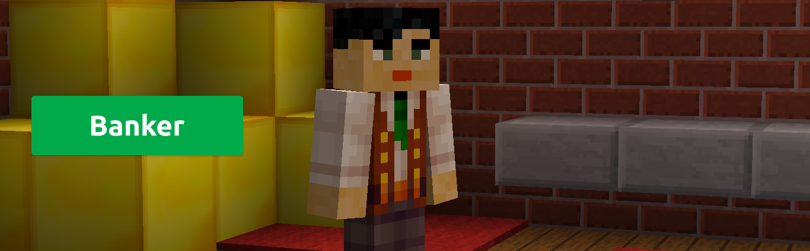
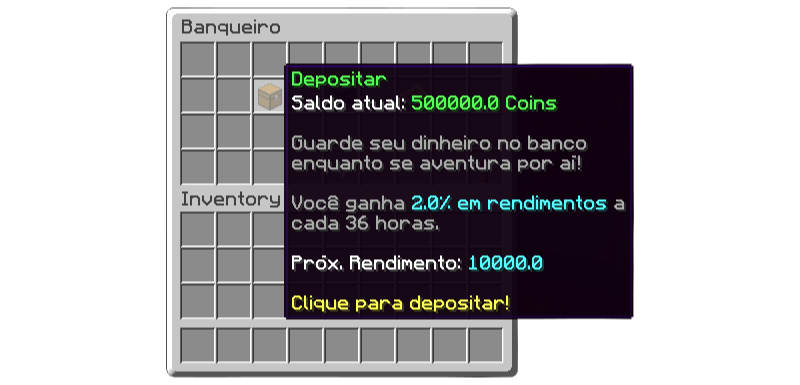
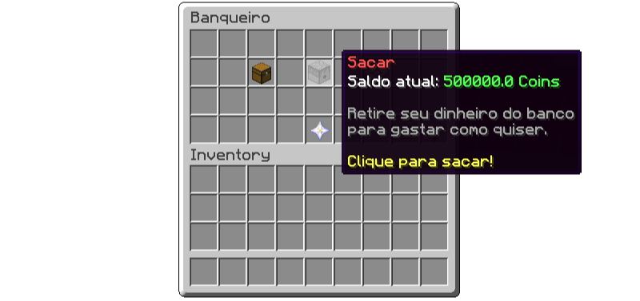
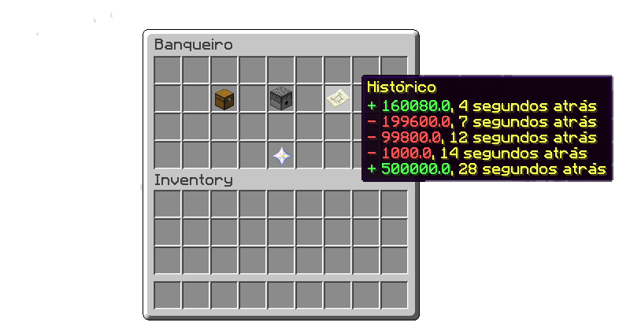

    

<h1 align="center">Bank Plugin</h1>

  <a href="#functionalities">Functionalities</a>&nbsp;&nbsp;&nbsp;|&nbsp;&nbsp;&nbsp;
  <a href="#getting-started">Getting started</a>&nbsp;&nbsp;&nbsp;|&nbsp;&nbsp;&nbsp;
  <a href="#license">License</a>

With the bank plugin on your server, players will have access to an NPC where they will be able to store their money, in addition, they will receive income over time.

## Functionalities

- Deposit

In the deposit menu the player can choose the amount to be deposited, which can be everything, half, 20%, or choose another amount.

    

- Withdraw

In the withdrawal menu the player will be able to choose the amount to be withdrawn, which can be everything, half, 20%, or choose another amount.

    

- Historic

In the history item the player will be able to see his last 10 transactions.

    

- Improvements

In the improvement menu the player will be able to pay the banker to improve his account type, to be able to store more coins and receive more income.

    

## Getting started

### Requirements

You must have the following plugins installed:
- [Citizens](https://dev.bukkit.org/projects/citizens)
- [ProtocolLib](https://dev.bukkit.org/projects/protocollib)
- [Vault](https://dev.bukkit.org/projects/vault)

You will need to have the plugin - Not yet available

You will need to have a MySQL database

### Step by step

After adding the plugin and starting the server, you must stop the server and open your plugins folder, right after doing this, you will need to open the config.yml file in the Bank folder and do the following steps:

- Edit the database connection information
- Change the autosave time, which by default is 10 minutes (Optional)
- Change the time for income in the players' accounts, which by default is 36 hours (Optional)
- Change the names of the account types (Optional)

Right after you add your configuration to the plugin, you can start the server again.

As the server is connected, you must enter the game and enter the command: <strong>/bank set</strong>, to add the NPC.

# License

This project is licensed under the MIT License.

Made by Hugo Souza ✌️